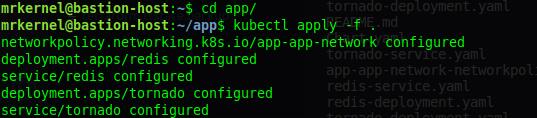
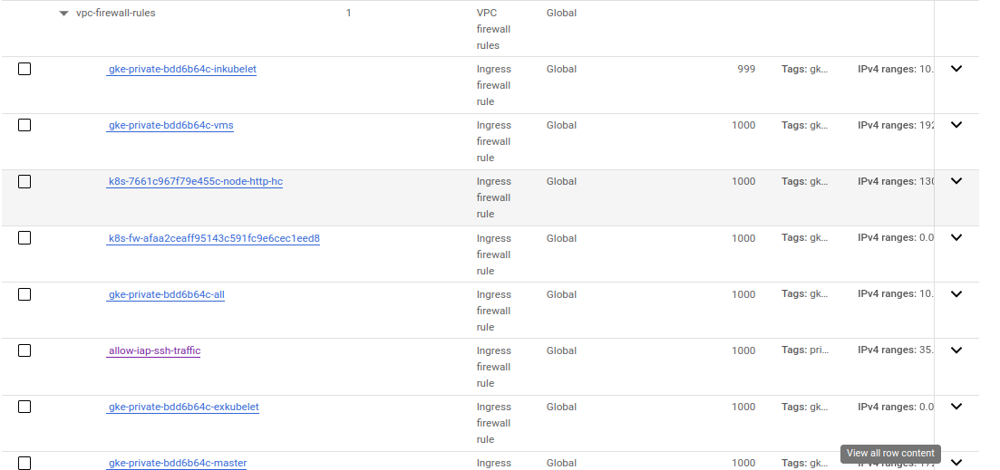

# GCP K8s Project
This repository contains a sample project that demonstrates how to deploy a simple web application on a Kubernetes cluster hosted on Google Cloud Platform (GCP).

# Challenge
create VPC with 2 subnets (management subnet & restricted subnet):
1. Management subnet has the following:
    • NAT gateway
    • Private VM
2. Restricted subnet has the following:
• Private standard GKE cluster (private control plan)

Notes:
1. Restricted subnet must not have access to internet
2. All images deployed on GKE must come from GCR or Artifacts registry.
3. The VM must be private.
4. Deployment must be exposed to public internet with a public HTTP load balancer.
5. All infra is to be created on GCP using terraform.
6. Deployment on GKE can be done by terraform or manually by kubectl tool.
7. The code to be build/dockerized and pushed to GCR is on here:
https://github.com/atefhares/DevOps-Challenge-Demo-Code
8. Don’t use default compute service account while creating the gke cluster, create
custom SA and attach it to your nodes.
9. Only the management subnet can connect to the gke cluster.


## Requirements
- Terraform 4.50.0 or later
- A GCP account with access to the following services:
    - Google Kubernetes Engine (GKE)
    - Google Container Registry (GCR)
- Google Cloud SDK installed and configured on your local machine
- Docker installed on your local machine
- kompose 

## Getting Started

1. Clone the repository
```
git clone https://github.com/ahmedsaadx/gcp-k8s-project.git 
cd gcp-k8s-project
```
1. Build Dockerfile and Push required images to gcr.io
```
cd k8s_files
docker build -t gcr.io/[your_project_id]/app:v1
docker push gcr.io/[your_project_id]/app:v1
docker pull redis
docker tag redis gcr.io/[your_project_id]/redis
docker push gcr.io/[your_project_id]/redis

```
3. Plan and apply the Terraform code
```
terraform init
terraform plan
terraform apply
```
4. ssh into bastion host and transfer k8s files to it
```
gcloud compute scp app/ bastion-host:~/
gcloud compute ssh bastion-host
```
5. run kubectl apply 
```
cd app
kubectl apply -f .
```


# results
### vpc pics
1.vpc info


2.subnet info


3.firewalls info



### cluster


### instances


### load balancers

1.load balancer info


2- frontend info

3- backend info 


### gcr 
1. images


### Rules (Restrictations)
1. control plane refuse connection from cloudshell

2.control plane refuse connection from myhost

3.node intance refuse ssh connection from public ip 


### final result


### Helm Chart
```
k8s_files/helm/
├── Chart.yaml
├── README.md
└── templates
    ├── app-app-network-networkpolicy.yaml
    ├── redis-deployment.yaml
    ├── redis-service.yaml
    ├── tornado-deployment.yaml
    └── tornado-service.yaml
```    
